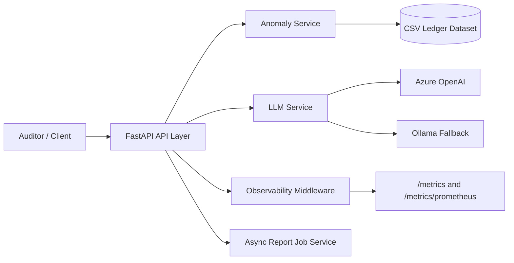

# AuditAI

## 1) Problem and Solution
Audit teams spend too much time manually reviewing large ledgers, and most flagged anomalies lack clear, consistent reasoning for fast decision-making.
AuditAI is a FastAPI backend that detects anomalous ledger transactions and explains audit risk with LLM-generated reasoning so auditors can move from raw flags to actionable decisions faster.  
It combines deterministic anomaly filtering with contextual AI explanations to reduce manual triage effort and improve consistency in first-pass audit reviews.  
The platform is designed for teams that need API-first integration into existing finance workflows, not a standalone dashboard.  
By exposing health, anomaly retrieval, explanation, report generation, chat, and metrics endpoints, it supports both analyst productivity and operational observability in one service.  
The core goal is to shorten investigation time per flagged transaction while preserving traceability, reproducibility, and deployment readiness for production environments.

## 2) Architecture Diagram (Mermaid.js)


## 3) Results / Benchmarks (Real Numbers)
- Measurement date: March 2, 2026
- Dataset size: `533,009` total ledger rows
- Flagged anomalies after filtering `label != regular`: `100` rows (`0.02%`)
- Risk distribution on flagged set: `70 High`, `30 Medium`, `0 Low`, `0 Unknown`
- `AnomalyService.list_anomalies()` over 20 runs:
  - Average: `1328.40 ms`
  - P50: `1298.91 ms`
  - P95: `1626.07 ms`
- `AnomalyService.get_by_transaction_id()` over 20 runs:
  - Average: `1140.80 ms`
  - P50: `1122.56 ms`
  - P95: `1367.70 ms`

## 4) Technical Decisions
- Chose FastAPI for typed request/response contracts, async support, and clean route-service separation.
- Kept the anomaly layer CSV-backed for deterministic local development and reproducible test behavior.
- Added dual LLM providers (Azure primary, Ollama fallback) to reduce deployment coupling.
- Added observability middleware plus Prometheus exposition for production monitoring and alerting.
- Implemented role-based API keys and async report jobs to support safer multi-user usage and non-blocking report generation.

## 5) Run an End-to-End API Flow
If you are running locally with Ollama, set a model you actually have installed (example uses `qwen2:0.5b`):
```powershell
$env:LLM_PROVIDER="ollama"
$env:OLLAMA_MODEL="qwen2:0.5b"
```

1. Start the API:
   ```powershell
   uvicorn backend.main:app --reload
   ```
2. In a second terminal, run the client flow script:
   ```powershell
   python ops/demo_flow.py --base-url http://127.0.0.1:8000
   ```
3. If API key auth is enabled, pass it:
   ```powershell
   python ops/demo_flow.py --base-url http://127.0.0.1:8000 --api-key <your-key>
   ```

The script exercises `GET /health`, `GET /anomalies`, `POST /explain`, `POST /chat`, `POST /audit-report/jobs`, and `GET /audit-report/jobs/{job_id}`.
