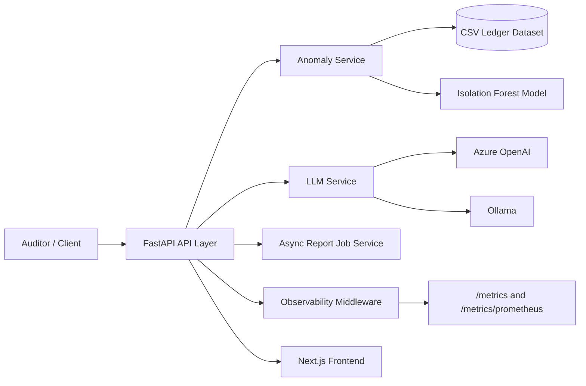

# AuditAI

## 1) Problem and Solution
Audit teams spend too much time manually reviewing large ledgers, and most flagged anomalies lack clear, consistent reasoning for fast decision-making.

AuditAI is a FastAPI backend with a Next.js dashboard that detects anomalous ledger transactions, explains audit risk with LLM-generated reasoning, and generates concise audit summaries. The goal is to shorten investigation time per flagged transaction while preserving traceability, reproducibility, and deployment readiness for production environments.

It combines:
- CSV-backed ledger data for deterministic local development
- Hybrid anomaly selection using dataset labels when available and Isolation Forest when labels are missing
- LLM-generated explanations, chat responses, and audit reports
- A React dashboard for anomaly review and reporting
- Health, readiness, metrics, and role-aware API access for operational visibility

## 2) Architecture Diagram

```mermaid
flowchart LR
    U[Auditor / Client] --> API[FastAPI API Layer]
    API --> A[Anomaly Service]
    A --> D[(CSV Ledger Dataset)]
    A --> ML[Isolation Forest Model]
    API --> L[LLM Service]
    L --> AZ[Azure OpenAI]
    L --> OL[Ollama]
    API --> J[Async Report Job Service]
    API --> M[Observability Middleware]
    M --> MET["/metrics and /metrics/prometheus"]
    API --> FE[Next.js Frontend]
```

## 3) How Anomaly Detection Works
### Hybrid Anomaly Selection
AuditAI supports two modes:

- If the CSV includes a `label` column, the backend treats non-`regular` rows as the flagged anomaly set.
- If the CSV has no `label` column, the backend falls back to Isolation Forest scoring.

This keeps the bundled dataset aligned with its authored anomaly labels while still supporting ML-only datasets.

### Isolation Forest Model
For unlabeled datasets, AuditAI uses scikit-learn's Isolation Forest to identify statistical outliers without requiring pre-labeled examples.

Features engineered for each transaction:
- Log-transformed amount
- Z-score by account
- Numeric account encoding
- Decimal precision of amount
- Absolute deviation from the median

Risk score mapping:
- `0.85-1.00` -> High
- `0.60-0.84` -> Medium
- `0.00-0.59` -> Low

For the bundled labeled dataset, the app preserves the intended severity mapping:
- `global` -> High
- `local` -> Medium

## 4) Results / Benchmarks
- Measurement date: March 2, 2026
- Dataset size: `533,009` total ledger rows
- Flagged anomalies after filtering `label != regular`: `100` rows (`0.02%`)
- Risk distribution on the flagged set: `70 High`, `30 Medium`, `0 Low`, `0 Unknown`
- `AnomalyService.list_anomalies()` over 20 baseline runs:
  - Average: `1328.40 ms`
  - P50: `1298.91 ms`
  - P95: `1626.07 ms`
- `AnomalyService.get_by_transaction_id()` over 20 baseline runs:
  - Average: `1140.80 ms`
  - P50: `1122.56 ms`
  - P95: `1367.70 ms`

## 5) Technical Decisions
- FastAPI for typed request/response contracts, async support, and clean route separation
- Next.js + React + TypeScript for the dashboard UI
- CSV-backed anomaly data for deterministic local behavior
- Isolation Forest for unlabeled datasets
- Explicit label filtering for labeled datasets
- Cached anomaly service to avoid rebuilding the ML pipeline on every request
- Async audit report jobs so report generation does not block the API
- Azure OpenAI primary support with Ollama as a local/self-hosted option
- Observability middleware plus Prometheus-compatible metrics
- Role-aware API key support for safer multi-user usage

## 6) Run Locally
### Backend Configuration
The backend reads configuration from the root [`.env`](./.env) file.

Example Ollama configuration:
```env
LLM_PROVIDER=ollama
OLLAMA_BASE_URL=http://localhost:11434
OLLAMA_MODEL=llama3.1:8b
API_KEYS={}
```

If you prefer temporary PowerShell env vars:
```powershell
$env:LLM_PROVIDER="ollama"
$env:OLLAMA_MODEL="llama3.1:8b"
```

### Start the Backend
From the repo root:
```powershell
python -m uvicorn backend.main:app --port 8010
```

Health check:
```powershell
curl -UseBasicParsing http://localhost:8010/health
```

Readiness check:
```powershell
curl -UseBasicParsing http://localhost:8010/ready
```

### Start the Frontend
In a second terminal:
```powershell
cd frontend
npm install
npm run dev
```

Set [frontend/.env.local](./frontend/.env.local) to:
```env
NEXT_PUBLIC_API_BASE_URL=http://localhost:8010
NEXT_PUBLIC_API_KEY=test-key-12345
```

Open `http://localhost:3000`.

## 7) End-to-End API Flow
1. Run the environment preflight:
   ```powershell
   python ops/check_env.py
   ```
2. Start the backend.
3. Run the demo flow:
   ```powershell
   python ops/demo_flow.py --base-url http://127.0.0.1:8010
   ```
4. If API key auth is enabled, pass the key:
   ```powershell
   python ops/demo_flow.py --base-url http://127.0.0.1:8010 --api-key <your-key>
   ```

The script exercises:
- `GET /health`
- `GET /anomalies`
- `POST /explain`
- `POST /chat`
- `POST /audit-report/jobs`
- `GET /audit-report/jobs/{job_id}`

## 8) Frontend Pages
- `/` -> Dashboard
- `/anomalies` -> Paginated anomaly list
- `/anomalies/[id]` -> Transaction detail with explanation
- `/reports` -> Async audit report generation and results

## 9) Notes
- The bundled dataset is labeled, so dashboard and report counts come from the flagged labeled subset, not from all ledger rows.
- For unlabeled CSVs, the app falls back to Isolation Forest scoring.
- The frontend uses a request timeout so dead backend connections surface as visible errors instead of hanging indefinitely.
